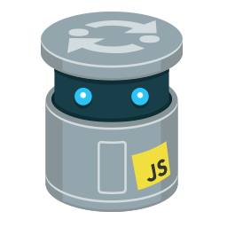

# JavaScript 

- Lessons
- Exercices
- Resources

1. [Everything JS](https://javascript.info/)
2. [Array Exercises](https://www.freecodecamp.org/learn/javascript-algorithms-and-data-structures/basic-javascript/store-multiple-values-in-one-variable-using-javascript-arrays)
3. [Comparison operator](https://illustrated.dev/fruit-comparison)
4. [Hoisting in Js](https://gomakethings.com/function-expressions-vs-function-declarations/)
5. [Falsy Truthy in Js](https://developer.mozilla.org/en-US/docs/Glossary/Falsy)
6. [Call stack](https://www.youtube.com/watch?v=W8AeMrVtFLY)
7. [Operator precedence](https://developer.mozilla.org/en-US/docs/Web/JavaScript/Reference/Operators/Operator_Precedence)
8. [increment && decrement](https://codeburst.io/javascript-increment-and-decrement-8c223858d5ed)
9. [Self-invoking Function or Immediately Invoked Function Expressions](https://blog.mgechev.com/2012/08/29/self-invoking-functions-in-javascript-or-immediately-invoked-function-expression/)
10. [IIFE freeCodeCamp video](https://www.youtube.com/watch?v=3cbiZV4H22c)
11. [Where not to use arrow function](https://wesbos.com/arrow-function-no-no/)
12. [How to Deep Copy Objects and Arrays in JavaScript](https://medium.com/javascript-in-plain-english/how-to-deep-copy-objects-and-arrays-in-javascript-7c911359b089)
13. [JavaScript Reference and Copy Variables](https://hackernoon.com/javascript-reference-and-copy-variables-b0103074fdf0)
14. [new keyWord in Js](https://developer.mozilla.org/en-US/docs/Web/JavaScript/Reference/Operators/new)
15. [destructuring in functions](https://simonsmith.io/destructuring-objects-as-function-parameters-in-es6)
16. [Book-Eloquent-JavaScript](https://eloquentjavascript.net/)
